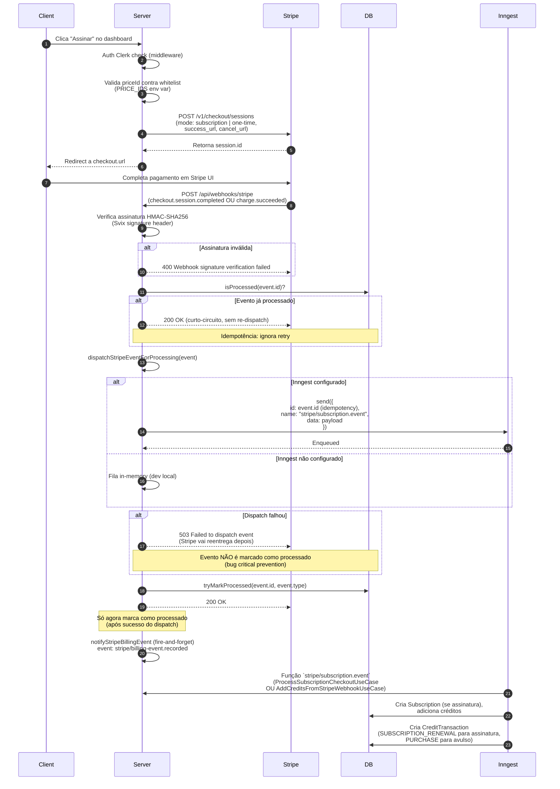
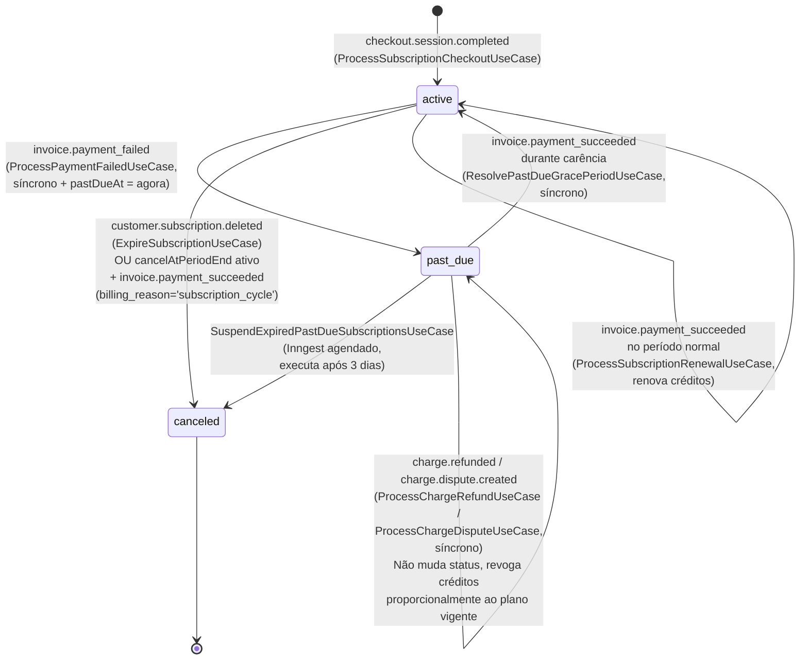

# Fluxo de Pagamento e Billing

Este documento descreve a arquitetura completa do sistema de pagamentos, créditos e assinaturas do AI Podcast Clipper, incluindo a integração com Stripe e a política de domínio de falhas de pagamento, reembolsos e disputas.

## Visão Geral

O sistema de pagamento é construído em três camadas:

1. **Webhooks do Stripe** → Verificação de assinatura e idempotência
2. **Fila de processamento** → Despacho assíncrono (Inngest) e síncrono
3. **Use Cases de domínio** → Lógica de negócio isolada (créditos, status de assinatura, carência, etc.)

A **taxonomia de planos** é centralizada no `PlanCatalogService`: cada um dos 4 price IDs reais do Stripe mapeia para um plano (STARTER/PRO) + quantidade de créditos (150/300/1800/3600, anual em lump sum). Um price ID desconhecido lança `InvalidPriceIdError`.

## Sequência: Checkout e Webhook



**Notas importantes:**
- Se `session.mode !== "subscription"`, o webhook dispara `AddCreditsFromStripeWebhookUseCase` (fluxo de pacotes avulsos). Esse código está vivo mesmo com pacotes descontinuados da venda.
- `notifyStripeBillingEvent` é disparado como fire-and-forget após o use case; se falhar, a rota responde 503 e Stripe reenvia, causando re-execução do use case (não há idempotência de `chargeId` neste caminho).
- **⚠️ Risco de segurança em serverless:** Se a instância congelar entre `tryMarkProcessed` (200 OK) e `notifyStripeBillingEvent` terminar, Stripe acredita sucesso mas notificação falha.

### Decisões de Design

- **Idempotência nativa**: O `event.id` do Stripe é usado como `id` no payload do Inngest, garantindo que Inngest deduque automaticamente retries do mesmo evento.
- **Ordem crítica**: O evento é marcado como processado **DEPOIS** de confirmar que o dispatch (síncrono ou async) teve sucesso. Se o dispatch falhar, respondemos `503` propositalmente para que o Stripe reentregue — esse era o bug que causava perda silenciosa de créditos pagos.
- **Dispatch failure handling**: Quando `INNGEST_EVENT_KEY` está configurado, uma falha em `inngest.send()` propaga a exceção para o chamador em vez de cair num fallback silencioso. Isso força o webhook a responder `503` e aguardar retry.

## Ciclo de Vida da Assinatura



### Estados e Transições

- **`active`**: Assinatura ativa, créditos renovam a cada período.
- **`past_due`**: Falha de pagamento detectada. `pastDueAt` é marcado com o timestamp da falha (não um tempo futuro). Um job agendado no Inngest verifica a cada X minutos se `pastDueAt` está mais antigo que agora - 3 dias; se sim, suspende a conta. Se o pagamento for bem-sucedido durante a carência, volta a `active` imediatamente e `pastDueAt` é limpo.
- **`canceled`**: Assinatura encerrada (por cancelamento explícito, expiração da carência ou exclusão via Stripe).
- **Reembolso/Disputa**: Não alteram o status da assinatura, apenas revogam créditos do período afetado via `CreditTransaction`.

### Política de Carência (Grace Period)

A carência de **3 dias** é uma decisão de negócio, não delegada ao timing de dunning automático do Stripe:

- `invoice.payment_failed` → marca `Subscription.status = "past_due"` e `pastDueAt = agora` (timestamp da falha) **sincronamente** no webhook.
- Um worker Inngest agendado (ex.: `SuspendExpiredPastDueSubscriptionsUseCase`) roda a cada X minutos e verifica se `pastDueAt` é mais antigo que agora - 3 dias. Se sim, marca como `canceled` e zera todos os créditos (`subscriptionCreditsSet`, `oneTimeCreditsSet`, `creditsSet`).
- Se `invoice.payment_succeeded` chegar **durante** a carência, `ResolvePastDueGracePeriodUseCase` limpa o status de volta para `active` imediatamente (síncrono) e limpa `pastDueAt`.

**Por que síncrono?** Porque a política de negócio exige que a conta seja marcada como "em atraso" no mesmo instante em que o webhook chega, não esperar um worker assíncrono que poderia levar segundos ou minutos. Isso garante que o front-end reflita o estado real da conta em tempo real.

## Ciclo de Vida do Crédito

```mermaid
flowchart TD
    subgraph "Aquisição"
        A1["Usuário completa checkout"] -->|checkout.session.completed| A2["ProcessSubscriptionCheckoutUseCase"]
        A2 -->|priceId → PlanCatalogService| A3["Resolve: STARTER (150 cr/ano)<br/>PRO (1800 cr/ano)<br/>etc"]
        A3 -->|Cria CreditTransaction: PURCHASE| A4["User.subscriptionCredits += créditos<br/>UploadedFile.creditsCost = 0"]
    end

    subgraph "Renovação Anual"
        R1["invoice.payment_succeeded<br/>billing_reason = 'subscription_cycle'"] -->|ProcessSubscriptionRenewalUseCase| R2["Calcula créditos do novo período"]
        R2 -->|Respeita priceId mapeado| R3["User.subscriptionCredits += créditos<br/>CreditTransaction: SUBSCRIPTION_RENEWAL"]
    end

    subgraph "Reserva (Hold) e Consumo"
        H1["Usuário inicia processamento"] -->|HoldCreditsUseCase| H2["User.subscriptionCredits -= amount<br/>User.reservedCredits += amount<br/>CreditTransaction: HOLD"]
        H2 -->|[sub:X,ot:Y] no description| H3["Hold registra breakdown<br/>(quantos eram subs vs one-time)"]
        
        C1["Processamento completa"] -->|ConsumeCreditsUseCase| C2["User.reservedCredits -= amount<br/>User.credits total -= amount<br/>CreditTransaction: CONSUME"]
        C2 -->|Se houver sobra (hold > consumido)| C3["Refund parcial de sobra"]
        C3 -->|RefundCreditsUseCase| C4["Restaura subs/one-time<br/>conforme breakdown do HOLD"]
        
        H3 -->|Falha no processamento| F1["RefundCreditsUseCase (on failure)"]
        F1 -->|Reverte hold completo| F2["User.reserved -= amount<br/>User.credits += amount<br/>CreditTransaction: REFUND"]
    end

    subgraph "Reembolso por Stripe (charge.refunded)"
        S1["Stripe notifica reembolso"] -->|ProcessChargeRefundUseCase| S2["Síncrono no webhook"]
        S2 -->|Mapeia invoiceId → período| S3["Revoga APENAS créditos<br/>do período afetado"]
        S3 -->|Não suspende conta| S4["CreditTransaction: REFUND<br/>(período específico)"]
    end

    subgraph "Disputa por Stripe (charge.dispute.created)"
        D1["Stripe notifica disputa"] -->|ProcessChargeDisputeUseCase| D2["Síncrono no webhook"]
        D2 -->|Mapeia chargeId → período| D3["Revoga créditos da disputa"]
        D3 -->|Não suspende conta| D4["CreditTransaction: REFUND<br/>(período da disputa)"]
    end

    A4 --> H1
    A4 --> R1
    R3 --> H1

    style A1 fill:#e1f5a2
    style R1 fill:#e1f5a2
    style H1 fill:#fff3b0
    style C1 fill:#fff3b0
    style S1 fill:#ffcdd2
    style D1 fill:#ffcdd2
```

### Fluxos Detalhados

#### 1. Aquisição Inicial (Checkout)

1. Usuário completa checkout no Stripe (modo subscription).
2. Webhook `checkout.session.completed` chega.
3. `ProcessSubscriptionCheckoutUseCase` resolve o plano via `PlanCatalogService.resolveByPriceId(priceId)`.
4. Cria registro `Subscription` com status `active`, período atual, etc.
5. Incrementa `User.subscriptionCredits` com o valor do plano (ex.: 150 para STARTER).
6. Cria `CreditTransaction` tipo `PURCHASE`.

#### 2. Renovação Periódica

Anualmente (ou conforme configurado), o Stripe emite `invoice.payment_succeeded` com `billing_reason = 'subscription_cycle'`.

1. `ProcessSubscriptionRenewalUseCase` extrai `currentPeriodStart` e `currentPeriodEnd` do evento.
2. Busca a assinatura e resolve o plano novamente via `stripePriceId` mapeado.
3. Incrementa `User.subscriptionCredits` novamente (reset anual).
4. Cria nova `CreditTransaction` tipo `PURCHASE`.

#### 3. Reserva (Hold) e Consumo

Quando o usuário inicia o processamento de um vídeo:

0. **Guards do modo manual (antes do hold)**: em `validate-and-reserve-credits` (`src/inngest/functions.ts`), se `mode="manual"` chegar sem cortes, o processamento lança `ManualCutsRequiredError` (`src/domain/errors/manual-cuts-required-error.ts`) **antes** de `HoldCreditsUseCase` ser chamado. Se houver cortes com `mode` omitido ou `"auto"`, lança `ManualCutsModeMismatchError` (`src/domain/errors/manual-cuts-mode-mismatch-error.ts`), também antes do hold. Nenhum HOLD é criado, nenhum crédito é reservado e não há cobrança pelo preço automático (RN-PIPE-MANUAL-02 / RN-PIPE-MANUAL-15 / D5). A checagem roda depois da validação de duração do plano e antes da reserva.

1. **`HoldCreditsUseCase`**: Calcula o custo (função da duração do vídeo; no modo manual, função dos cortes via `calculateManualCutsCredits`), debita de `subscriptionCredits` + `oneTimeCredits` (prioridade), move para `reservedCredits`, cria transação `HOLD`.
   - O description do HOLD inclui `[sub:X,ot:Y]` para rastrear a origem dos créditos reservados.

2. **Processamento**: Pipeline do backend consome o vídeo. Se bem-sucedido:
   - **`ConsumeCreditsUseCase`**: Debita de `reservedCredits`, cria transação `CONSUME`.
   - Se o hold foi maior que o consumido (ex.: hold de 100, consumido 80):
     - **`RefundCreditsUseCase`** automático: Restaura a sobra (20) de volta para `subscriptionCredits`/`oneTimeCredits` conforme o breakdown registrado no HOLD.

3. **Se houver falha no processamento**:
   - **`RefundCreditsUseCase`** (manual, chamada pelo handler de erro): Reverte o hold completo, restaura créditos integralmente.

> **Gap conhecido (2026-10-09):** o preço do hold depende de `event.data.mode === "manual"` com cortes presentes, enquanto o modo enviado ao backend é derivado de `manualCutsJson` ou dos cortes do evento (`buildProcessVideoPayload`). Como os schemas aceitam `mode: "auto"` junto com `manualCuts`, essa combinação cobra o preço automático e processa os cortes em modo manual. Ver `../operacao/checklist-go-live.md`.

#### 4. Reembolso por Charge Refunded

Quando o Stripe notifica `charge.refunded`:

1. **`ProcessChargeRefundUseCase`** (síncrono, sem Inngest):
   - Busca a assinatura do cliente.
   - Calcula o valor reembolsado (`charge.refunds.data` soma).
   - Revoga créditos proporcionalmente: `(refundAmountCents / monthlyPriceCents) * monthlyCredits` conforme o plano vigente do usuário.
   - O `invoiceId`/`chargeId` aparece apenas na descrição da transação, não em lógica de período específico.
   - Cria `CreditTransaction` tipo `REFUND` com descrição técnica (ID do charge/invoice, valor reembolsado).
   - **Não altera o status da assinatura** (continua `active` ou `past_due`).

#### 5. Disputa por Chargeback

Quando o Stripe notifica `charge.dispute.created`:

1. **`ProcessChargeDisputeUseCase`** (síncrono, sem Inngest):
   - Busca o cliente.
   - Calcula o valor em disputa do objeto `Charge`.
   - Revoga créditos proporcionalmente: mesma lógica do refund, baseado no plano vigente.
   - Cria `CreditTransaction` tipo `REFUND` com referência ao charge ID.
   - **Não altera o status da assinatura**.

### Priorização de Créditos

Ao debitar créditos (ex.: em `HoldCreditsUseCase`), o sistema segue a ordem:

1. **Créditos de Assinatura** (`subscriptionCredits`): Renovam anualmente, são o "recurso principal".
2. **Créditos Avulsos** (`oneTimeCredits`): Pacotes pontuais comprados (atualmente **descontinuados** do sistema de venda, mas ainda suportados no domínio para compatibilidade com histórico).

Quando há `charge.refunded` ou `charge.dispute.created`, o sistema revoga créditos **proporcionalmente ao plano vigente do usuário**, não por período específico. Isso significa: se um reembolso parcial chega (ex: 50% da cobrança), 50% dos créditos daquele ciclo são revogados, não importa quando foi. Se for reembolso total, 100% dos créditos do ciclo são revogados.

## Tabelas e Transações

```
User
├── credits (total: sub + one-time + reserved)
├── subscriptionCredits
├── oneTimeCredits
└── reservedCredits

Subscription
├── stripeCustomerId (FK)
├── stripeSubscriptionId (UK)
├── stripePriceId (mapeia plano)
├── status (active, past_due, canceled)
├── currentPeriodStart
├── currentPeriodEnd
├── cancelAtPeriodEnd
├── pastDueAt (opcional, carência de 3 dias)
└── plan (STARTER, PRO, etc)

CreditTransaction
├── userId (FK)
├── amount
├── type (PURCHASE, HOLD, CONSUME, REFUND)
└── description (rastreamento)

ProcessedWebhookEvent
├── id (PK, gerado internamente via CUID)
├── stripeEventId (UNIQUE, event.id do Stripe)
├── eventType (checkout.session.completed, etc)
└── processedAt
```

## Eventos Stripe Tratados

| Evento | Handler | Modo | Lógica |
|--------|---------|------|--------|
| `checkout.session.completed` | `dispatchStripeSubscriptionEvent` | Async (Inngest) | Cria `Subscription`, adiciona créditos |
| `invoice.payment_succeeded` | `dispatchStripeSubscriptionEvent` + `ResolvePastDueGracePeriodUseCase` | Async + Sync | Renova créditos; limpa carência se aplicável |
| `invoice.payment_failed` | `ProcessPaymentFailedUseCase` | Sync | Marca `past_due`, inicia carência de 3 dias |
| `customer.subscription.updated` | `dispatchStripeSubscriptionEvent` | Async | Atualiza `status`, `cancelAtPeriodEnd` |
| `customer.subscription.deleted` | `dispatchStripeSubscriptionEvent` | Async | Marca `canceled` |
| `charge.refunded` | `ProcessChargeRefundUseCase` | Sync | Revoga créditos do período, sem suspender |
| `charge.dispute.created` | `ProcessChargeDisputeUseCase` | Sync | Revoga créditos da disputa, sem suspender |

## Fluxo de Erro e Recuperação

```mermaid
flowchart TD
    A["Webhook chega no /api/webhooks/stripe"] --> B["Verifica assinatura"]
    B -->|Inválida| B1["400 Signature failed"]
    B -->|Válida| C["isProcessed(event.id)?"]
    
    C -->|Já processado| C1["200 OK (curto-circuito)"]
    C -->|Novo| D["dispatchStripeEventForProcessing"]
    
    D -->|Inngest configurado| E["inngest.send()"]
    D -->|Inngest não configurado| E2["Fila in-memory"]
    
    E -->|Erro de rede/timeout| F["Falha no dispatch"]
    E2 -->|Sucesso| G["tryMarkProcessed(event.id)"]
    E -->|Sucesso| G
    
    F -->|Antes de marcar processado| F1["503 Service Unavailable<br/>(Stripe vai reentrega)"]
    
    G --> H["200 OK"]
    
    F1 --> I["Stripe aguarda retry"]
    I -->|Próximo retry (com mesmo event.id)| A
    
    H --> J["Inngest processa<br/>(ou fila local)"]
    J -->|Sucesso| K["Créditos adicionados"]
    J -->|Falha na use case| L["Observabilidade/logs<br/>(evento já marcado)"]
    
    style F1 fill:#ffcdd2
    style L fill:#fff3b0
    style K fill:#c8e6c9
```

### Por que "falha do dispatch" retorna 503?

Se o Inngest falhar ao enfileirar um evento (ex.: timeout de rede, servidor indisponível), o webhook responde **503 em propósito**. Isso sinaliza ao Stripe que o webhook falhou e deve reenviar mais tarde. Quando reenviar, o `event.id` será o mesmo, então:

1. Se o dispatch anterior tiver criado registros parciais (race condition), a segunda tentativa o encontrará e abortará cedo (idempotência).
2. Se o dispatch anterior falhou completamente, a segunda tentativa conseguirá enfileirar.

Nunca marcamos um evento como "processado" antes de confirmar que o dispatch foi bem-sucedido — essa é a principal prevenção contra perda silenciosa de créditos.

## ⚠️ Riscos Conhecidos Não Confirmados

### Suspeita de Bug no Cálculo de Reembolso

**Severidade**: HIGH (não confirmado)

O webhook handler em `src/app/api/webhooks/stripe/route.ts` (linhas ~332-335) calcula o valor reembolsado assim:

```typescript
const refundAmountCents = charge.refunds.data.reduce(
  (sum, refund) => sum + refund.amount,
  0
);
```

**Risco**: O objeto `Charge` recebido no payload webhook do Stripe pode **não vir com `refunds` expandido por padrão**. Isso causaria `charge.refunds.data` ser `undefined` ou vazio, fazendo `refundAmountCents` sempre ser `0`, e a revogação de créditos por reembolso nunca acontecer na prática — apesar do código existir e os testes (com payload mockado/expandido manualmente) passarem.

**Confirmação pendente**: Isso só pode ser validado com um evento real do Stripe em modo teste (sandbox). O usuário ainda não configurou os 4 price IDs no Stripe, então essa verificação fica bloqueada.

**Ação recomendada**: Antes de confiar nesta feature em produção, disparar um reembolso de teste real no Stripe (modo teste) e confirmar no banco que o crédito foi de fato revogado (`CreditTransaction` tipo `REFUND` criada com valor esperado).

---

### Fila em Memória Sem Guard de Ambiente

**Severidade**: HIGH

Em `src/infrastructure/queue/stripe-queue.ts` (linhas 86-98, 107-122), há um fallback para fila em memória:

```typescript
if (INNGEST_EVENT_KEY) {
  // dispatch ao Inngest
} else {
  // fallback: fila in-memory (não durável)
}
```

**Risco**: Não verifica `NODE_ENV`. Se `INNGEST_EVENT_KEY` faltar em produção por engano (erro de configuração), o webhook:
1. Enfileira o evento na memória local (não durável, não persistido em BD)
2. **Marca o evento como processado mesmo assim** (`ProcessedWebhookEvent` row é inserido)
3. Na próxima reinicialização da instância, a fila em memória é perdida
4. Créditos nunca são aplicados, usuário fica sem acesso

Isso **reabre exatamente o bug de perda de crédito que a Fase 3 desta sessão corrigiu** (corrida entre webhook retornar 200 OK e dispatch confirmar sucesso).

**Mitigação recomendada**: 
- Adicionar `NODE_ENV !== "development"` || `INNGEST_EVENT_KEY` check
- Ou falhar explicitamente em produção se `INNGEST_EVENT_KEY` faltar (em vez de silenciosamente fallback)
- Adicionar alerta observacional quando fallback é usado

---

## Referências no Código

- **Webhook handler**: `ai-podcast-clipper-frontend/src/app/api/webhooks/stripe/route.ts`
- **Fila e dispatch**: `ai-podcast-clipper-frontend/src/infrastructure/queue/stripe-queue.ts`
- **Use cases de crédito**: `ai-podcast-clipper-frontend/src/application/use-cases/credits/`
- **Catálogo de planos**: `ai-podcast-clipper-frontend/src/application/services/plan-catalog.service.ts`
- **Schema do banco**: `ai-podcast-clipper-frontend/prisma/schema.prisma`
