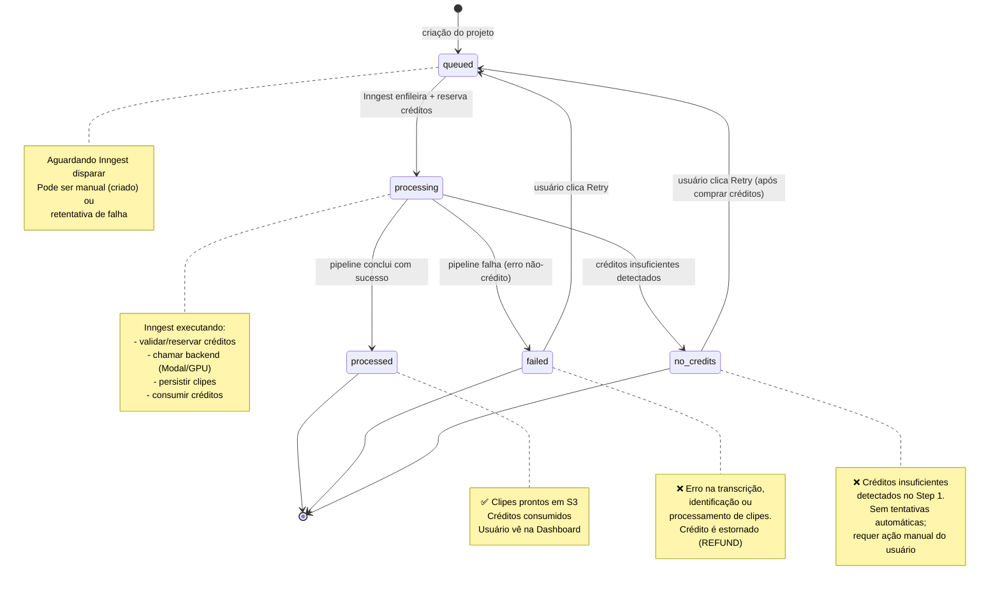

# Arquitetura do Fluxo de Processamento de Vídeo

Este documento descreve o fluxo completo de processamento de podcasts em clipes verticais, desde a importação do vídeo até a entrega dos clipes finais no S3. Ele reflete a **consolidação do pipeline** realizada para eliminar drift entre ambientes (Modal/produção e GPU local/dev).

## Visão Geral: Fluxo Ponta a Ponta

```mermaid
flowchart TD
    A["👤 Usuário importa vídeo do YouTube"] -->|Frontend| B["CreateProjectClient: gera S3 key + cria UploadedFile"]
    B -->|status: queued| C["Inngest recebe ProcessVideoEvent"]
    
    C -->|Step 1: validate-and-reserve-credits| D{["Baixar do YouTube (se aplicável)<br/>Validar duração do plano<br/>mode=manual sem cortes: erro, sem hold<br/>Reservar créditos (HOLD)<br/>manual: preço por cortes / auto: preço por duração"]}
    D -->|Hold bem-sucedido| E["Step 2: mark-processing"]
    D -->|Insuficiente de créditos| F["❌ Status: no credits"]
    
    E -->|Status: processing| G["Step 3: call-modal-gpu"]
    G -->|HTTP POST ao PROCESS_VIDEO_ENDPOINT| H["Modal (Produção) OU GPU Local (Dev)"]
    
    H --> I["core/video_pipeline.run_video_processing_pipeline(request)"]
    I --> I1{"request.mode"}
    I1 -->|"auto"| A1["1. Transcrição (WhisperX)"]
    A1 --> A2["2. Gemini: identify_moments<br/>clips[:5] (clips_limit)"]
    I1 -->|"manual"| M1["1. ffprobe: duração real do vídeo"]
    M1 -->|"algum corte end > duração"| MX["HTTP 422: requisição inteira rejeitada<br/>sem transcrição e sem clipes"]
    M1 -->|"todos os cortes dentro da duração"| M2["2. Transcrição (WhisperX)<br/>serve às legendas"]
    M2 --> M3["Gemini PULADO<br/>clipes = manual_cuts (todos, sem limite de 5)"]
    A2 --> K["Para cada clipe"]
    M3 --> K
    K --> L["core/clip_pipeline.process_clip"]
    
    L --> M["3. Corte + Detecção de Fala Ativa"]
    M -->|FFMPEG: corta segmento| N["4. LR-ASD: detecta falante ativo"]
    N -->|OpenCV/FFMPEGCV: reframe vertical| O["5. Vertical Reframe 9:16"]
    O -->|pysubs2 + FFMPEG: queima legendas| P["6. Legendas Stylizadas"]
    P -->|S3 upload| Q["7. Upload S3 (clips/)"]
    
    Q --> R["✅ Modal retorna ModalProcessVideoResponse"]
    R -->|clips[] metadata| S["Step 4: persist-clips-and-consume"]
    S -->|INSERT INTO Clip| T["Persiste cada clipe no banco"]
    T -->|CONSUME transaction| U["Consome créditos reservados"]
    U -->|Status: processed| V["✅ Projeto concluído com sucesso"]
    
    style A fill:#e1f5ff
    style V fill:#c8e6c9
    style F fill:#ffcdd2
    style H fill:#fff9c4
    style I fill:#f3e5f5
    style L fill:#f3e5f5
    style MX fill:#ffcdd2
```

## Estados do Projeto (UploadedFile)

O processamento de um vídeo passa por uma série de estados bem definidos, com suporte a retry em caso de falha:



## Consolidação do Pipeline: Por Que Compartilhamos `core/`?

**Antes da consolidação**, existiam duas implementações distintas:
- `main.py` (Modal/produção): tinha sua própria lógica de pipeline, patches de compatibilidade com PyTorch/torchaudio
- `local_server.py` (GPU local/dev): tinha sua própria versão da mesma lógica, com patches diferentes

Isso causava **drift**: uma mudança em um ambiente poderia não ser refletida no outro, levando a comportamentos diferentes e bugs em produção que nunca apareciam em dev.

**Depois da consolidação**, a lógica real vive em módulos compartilhados dentro de `core/`:
- `core/video_pipeline.py` — orquestração: transcrição → identificação de momentos → processamento de clipes
- `core/clip_pipeline.py` — orquestra por-clip: corte → LR-ASD → reframe vertical → legendas → S3
- `core/transcription.py`, `core/moments.py`, `core/active_speaker_detection.py`, `core/vertical_video.py`, `core/subtitles.py` — módulos especializados

Os dois deploy wrappers são **finos**:
- `main.py` — apenas decorators Modal (`@app.function`), gerenciamento de secrets do Modal, nada de lógica
- `local_server.py` — apenas FastAPI routes + env vars locais, nada de lógica

A **única diferença** entre produção e dev agora é a camada de infra/deploy, não a lógica. Isso garante que ambos processem exatamente da mesma forma.

### Upload Direto (Status Atual)

A funcionalidade de upload direto de arquivo de vídeo (`generateUploadUrl`) **existe no backend**, mas está **escondida na UI** por decisão de produto. Atualmente, o único fluxo ativo é a importação via YouTube. Se a feature for reativada, a infra já suporta ambos os fluxos (`sourceType: UPLOAD | YOUTUBE`).

## Fluxo Detalhado por Etapa

### Step 1: Validar e Reservar Créditos (Inngest)

**Arquivo**: `src/inngest/functions.ts::processVideoHandler` (Step 1)

1. Busca o `UploadedFile` do banco
2. Se `sourceType === "YOUTUBE"`, baixa o vídeo via `downloadYouTubeVideo()` (chama `YOUTUBE_DOWNLOAD_ENDPOINT`)
3. Atualiza `s3Key` e `durationSeconds` no banco
4. Valida duração máxima conforme o plano do usuário (`validateVideoDuration`)
5. Se `mode === "manual"` e não há cortes, lança `ManualCutsRequiredError` (`src/domain/errors/manual-cuts-required-error.ts`) **antes** de qualquer hold: nenhum crédito é reservado e não há fallback silencioso para o preço automático (RN-PIPE-MANUAL-02 / D5). Se há cortes e `mode !== "manual"`, lança `ManualCutsModeMismatchError` (`src/domain/errors/manual-cuts-mode-mismatch-error.ts`), também antes do hold (RN-PIPE-MANUAL-15)
6. Calcula créditos necessários:
   - Modo **manual** (manual cuts): usa `calculateManualCutsCredits(manualCuts)`
   - Modo **auto** (clipe automático): usa duração do vídeo como base
7. **Reserva créditos** via `HoldCreditsUseCase` (cria `CreditTransaction` com `type: HOLD`)
   - Se insuficiente, lança erro → capturado no `.catch()` → status fica `"no credits"`
   - Se bem-sucedido, retorna `heldCredits` para próximas etapas

> **Gap conhecido (2026-10-09):** `mode` e `manualCuts` chegam como campos independentes. Os schemas Zod (`src/domain/schemas/process-video.schema.ts`, `src/domain/schemas/import-youtube-video.schema.ts`) aceitam `mode: "auto"` junto com cortes. Nesse caso o hold usa o preço automático (lê `event.data.mode`), mas o payload para o backend deriva o modo de `manualCutsJson`/cortes presentes (`buildProcessVideoPayload`) e envia `mode: "manual"`. Ver `../operacao/checklist-go-live.md`.

**Transações de crédito**:
- `HOLD`: reserva créditos provisórios (não deduzido ainda do saldo do usuário)
- `CONSUME`: debita os créditos reservados quando o processamento sucede
- `REFUND`: estorna créditos se o processamento falha

### Step 2: Marcar como Processing (Inngest)

**Arquivo**: `src/inngest/functions.ts::processVideoHandler` (Step 2)

Atualiza `UploadedFile.status = "processing"` no banco para refletir que o processamento começou.

### Step 3: Chamar Modal/GPU (Inngest)

**Arquivo**: `src/inngest/functions.ts::processVideoHandler` (Step 3)

Faz HTTP POST para `env.PROCESS_VIDEO_ENDPOINT` (Modal em produção OU GPU local em dev):

```json
{
  "s3_key": "uploads/user-123/video.mp4",
  "preset": "HORMOZI",  // ou outro preset de legendas
  "genre": "auto",
  "aspect_ratio": "9:16",
  "auto_zoom": true,
  "mode": "auto",  // ou "manual"
  "manual_cuts": [  // opcional, só se mode === "manual"
    { "title": "Clip 1", "start": 0, "end": 45 },
    { "title": "Clip 2", "start": 50, "end": 95 }
  ]
}
```

Ambos (Modal e GPU local) recebem esse payload. `core/schemas.py::ProcessVideoRequest` usa `extra="forbid"`: campo desconhecido gera HTTP 422 em vez de ser descartado em silêncio (RN-PIPE-MANUAL-13). `mode` tem default `"auto"` (RN-PIPE-MANUAL-14). `mode="manual"` exige `manual_cuts` não vazio, e `mode="auto"` não aceita cortes (RN-PIPE-MANUAL-02/03). `aspect_ratio`, `auto_zoom` e `genre` são aceitos, mas **ainda não têm efeito** no processamento (RN-PIPE-MANUAL-12, gap conhecido D1). `preset` de legenda é validado contra uma allowlist (`SubtitlePreset`); valor fora dela gera 422 antes de qualquer comando de shell (RN-PIPE-PRESET-01, RNF-SEC-16).

### Fluxo Principal do Backend: `core/video_pipeline.run_video_processing_pipeline()`

**Arquivo**: `ai-podcast-clipper-backend/core/video_pipeline.py`

#### 1. Resolver Caminho do Vídeo
```python
video_path = resolve_input_video_path(s3_key, base_dir, s3_bucket)
```
- Se `s3_key` é um path local que existe (útil para dev), copia direto
- Senão, baixa do S3
- Se `request.mode == "manual"`: logo após resolver o caminho, `get_video_duration_seconds` (ffprobe, `core/video_probe.py`) lê a duração real e `validate_manual_cuts_against_duration` rejeita a requisição inteira (HTTP 422) se qualquer corte tiver `end` maior que essa duração (RN-PIPE-MANUAL-06). Isso acontece antes da transcrição.

#### 2. Transcrição (WhisperX)
```python
transcript_segments_json = transcriber.transcribe(base_dir, video_path)
transcript_segments = json.loads(transcript_segments_json)
```

**Resultado**: lista de segmentos com estrutura (por palavra):
```json
{
  "word": "hello",
  "start": 0.5,
  "end": 1.2
}
```

**Nota**: O segmento **não inclui** `confidence` nem `speaker` neste ponto. A diarização (detecção de falante) ocorre posteriormente, em nível de clipe (via LR-ASD), não na transcrição global.

#### 3. Identificação de Momentos Virais (Gemini)

Só executa no modo `auto`. No modo `manual` esta etapa é pulada e a transcrição (passo 2) continua rodando (RN-PIPE-MANUAL-08).
```python
moments_extraction = identify_moments(transcript_segments, gemini_client)
clips_to_process = moments_extraction.clips[:clips_limit]
```

**Arquivo Principal**: `ai-podcast-clipper-backend/core/moments.py::identify_moments()`

- Usa **Gemini Structured Outputs** com um prompt que pede: "encontre histórias/hooks/perguntas/respostas de 30-60s"
- Retorna lista de `ClipItem` (title, hook, virality_score, reason, start, end)
- **Nota sobre modelo**: O código usa `gemini-2.5-flash` como default (`core/moments.py:48`), mas documentação/AGENTS.md mencionam "Gemini 2.5 Pro". Isso pode ser decisão de custo deliberada — confirmar com usuário se alinhado.

#### 4. Processar Cada Clipe
```python
for clip_item in clips_to_process:
    clip_result = process_clip(
        base_dir, original_video_path, s3_key,
        start_time=clip_item.start,
        end_time=clip_item.end,
        clip_index=index,
        ...
    )
    processed_clips.append(clip_result)
```

### Fluxo por Clipe: `core/clip_pipeline.process_clip()`

**Arquivo**: `ai-podcast-clipper-backend/core/clip_pipeline.py`

Para cada candidato a clipe (30-60s):

#### 1. Cortar Segmento (FFMPEG)
```bash
ffmpeg -y -i original.mp4 -ss {start_time} -t {duration} clip_segment.mp4
```

Isola apenas o segmento de interesse (ex.: 120s a 150s do vídeo original).

#### 2. Extrair Áudio para LR-ASD (FFMPEG)
```bash
ffmpeg -y -i clip_segment.mp4 -vn -acodec pcm_s16le -ar 16000 -ac 1 audio.wav
```

LR-ASD (Light-weight Relation-aware Active Speaker Detection) é um modelo que detecta quem está falando em cada frame.

#### 3. Executar LR-ASD (Columbia/Light-ASD)
```python
tracks, scores = run_active_speaker_detection(clip_name, base_dir, asd_dir="/asd")
```

**Arquivo**: `ai-podcast-clipper-backend/core/active_speaker_detection.py`

- Roda o modelo LR-ASD no segmento cortado (não no vídeo inteiro)
- Retorna `tracks` (rosto/região por frame) e `scores` (confiança de detecção)

#### 4. Reframe Vertical (FFMPEGCV)
```python
create_vertical_video(tracks, scores, pyframes_path, pyavi_path, audio_path, vertical_mp4_path)
```

**Arquivo**: `ai-podcast-clipper-backend/core/vertical_video.py`

- Usa OpenCV/FFMPEGCV (aceleração GPU) para:
  1. Extrair frames do clip
  2. Para cada frame, usar os `tracks` (detecção de falante) para calcular bbox do rosto
  3. Cropear em 9:16 centralizando o rosto
  4. Re-montar em vídeo 9:16 com áudio sync

Resultado: `video_out_vertical.mp4` (9:16, 30-60s, com rosto do falante centrado).

#### 5. Gerar Legendas Stylizadas (pysubs2 + FFMPEG)
```python
create_subtitles_with_ffmpeg(
    transcript_segments, clip_start, clip_end,
    vertical_mp4_path, output_path, preset="HORMOZI", max_words=5
)
```

**Arquivo**: `ai-podcast-clipper-backend/core/subtitles.py`

- Filtra transcrição para o range [clip_start, clip_end]
- Agrupa palavras em linhas (max 5 palavras)
- Aplica estilo de legenda (cores, fontes, posição) conforme `preset`
- Queima legendas no vídeo com FFMPEG overlay

Resultado: `video_with_subtitles.mp4` (9:16 + legendas).

#### 6. Upload para S3
```python
s3_client.upload_file(str(subtitle_output_path), s3_bucket, output_s3_key)
```

**Arquivo**: `ai-podcast-clipper-backend/core/s3_paths.py`

```python
def compute_clip_output_s3_key(s3_key: str, clip_name: str) -> str:
    # Ex.: "uploads/user-123/video.mp4" + "clip_0"
    # → "clips/user-123/video/clip_0.mp4"
```

#### 7. Retornar Metadados
```python
clip_metadata = {
    "s3_key": output_s3_key,
    "title": clip_item.title,
    "hook": clip_item.hook,
    "virality_score": clip_item.virality_score,
    "reason": clip_item.reason,
    "start": start_time,
    "end": end_time,
    "duration": duration,
    "preset": preset,
}
```

---

### Step 4: Persistir Clipes e Consumir Créditos (Inngest)

**Arquivo**: `src/inngest/functions.ts::processVideoHandler` (Step 4)

O Modal retorna `ModalProcessVideoResponse`:
```typescript
{
  success: true,
  file_id: "uploads/user-123/video.mp4",
  clips: [
    {
      s3_key: "clips/user-123/video/clip_0.mp4",
      title: "The Secret...",
      hook: "You won't believe this...",
      virality_score: 8.5,
      reason: "Compelling hook + revelation",
      start: 120,
      end: 155,
      ...
    },
    ...
  ]
}
```

1. Para cada clipe no response:
   - Cria `Clip` row no banco com metadados
   - Mapeia campo `s3_key` (snake_case) → `s3Key` (camelCase) conforme Prisma
   - Armazena `transcriptWords` (opcional, para future replay/editing)

2. Chama `ConsumeCreditsUseCase`:
   - Cria `CreditTransaction` com `type: CONSUME`
   - Deduz créditos do saldo do usuário (converte `reservedCredits` → `subscriptionCredits`/`oneTimeCredits`)

3. Atualiza `UploadedFile.status = "processed"`

4. Retorna sucesso

## Fluxo de Falha e Retry

### Falha Durante o Processamento

Se qualquer etapa falha (ex.: erro de GPU, Gemini timeout, S3 upload):

1. Inngest captura a exceção no `.catch()` do `processVideoHandler`
2. Formata mensagem amigável (`formatFriendlyErrorMessage`)
3. **Tenta estornar créditos** via `RefundCreditsUseCase`:
   - Remove da `reservedCredits`
   - Cria `CreditTransaction` com `type: REFUND`
4. Atualiza `UploadedFile`:
   - `status = "failed"` (ou `"no credits"` se foi falha de crédito)
   - `errorMessage = "...mensagem amigável..."`

Se o `processVideo` Inngest falhar após retries (padrão: 1 retry), o hook `onFailure` tenta estornar créditos novamente.

**Arquivo**: `src/inngest/functions.ts::processVideo` → `onFailure` hook

### Retry Manual do Usuário

Usuário clica **"Reprocessar"** na Dashboard:

**Arquivo**: `src/application/use-cases/retry-project.use-case.ts`

1. Valida que projeto existe e pertence ao usuário
2. Reseta `UploadedFile`:
   - `status = "queued"`
   - `errorMessage = null`
   - Deleta qualquer `Clip` que foi parcialmente gerado (evita duplicatas)
   - Permite opcionalmente atualizar `subtitlePreset`, `clipModel`, `aspectRatio`, etc.
   - O `mode` reenfileirado é derivado de `manualCutsJson != null` (D6), nunca de `clipModel`. **Gap conhecido:** cortes de projeto importado do YouTube não são gravados em `manualCutsJson` na importação (`ImportYouTubeVideoUseCase`), então o retry reprocessa em modo automático. Ver `../operacao/checklist-go-live.md`.
3. Envia novo `ProcessVideoEvent` ao Inngest
4. Volta ao Step 1 (reservar créditos, processar, etc.)

## Sumário: Diferenças Entre Ambientes

| Aspecto | Modal (Produção) | GPU Local (Dev) |
|---------|------------------|-----------------|
| **Deploy wrapper** | `main.py` (decorators Modal) | `local_server.py` (FastAPI) |
| **Secrets** | Modal secrets (`GEMINI_API_KEY`, etc.) | Env vars locais (`.env`) |
| **GPU** | Modal GPU (NVIDIA L40S) | GPU local (ex.: RTX 4090) |
| **Lógica pipeline** | `core/video_pipeline.py` + módulos | Mesmo `core/video_pipeline.py` + módulos |
| **S3 access** | AWS credentials via Modal secrets | AWS credentials via env var `AWS_*` |
| **Input video** | S3 path | S3 path OU local path (fallback em dev) |
| **S3 bucket** | Hardcoded: `"ai-podcast-clipper"` | Hardcoded: `"ai-podcast-clipper"` |

**Resultado**: ambos produzem exatamente os mesmos clipes, na mesma ordem, com a mesma qualidade. Não há surpresas ao fazer deploy em produção.

**⚠️ Riscos Conhecidos:**

1. **Chave S3 gerada pelo frontend (inseguro)**: O `s3_key` é gerado no frontend por `CreateProjectClient` (via `utils/generate-upload-path.ts`). O backend não redireciona — apenas processa a chave recebida. Quem tiver o token de autenticação pode processar qualquer `s3_key` no bucket alcançável.

2. **Fallback local em produção (SSRF possível)**: `core/video_pipeline.py::resolve_input_video_path` (linhas 37-38) aceita caminho de arquivo local mesmo no Modal em produção. Se um `s3_key` coincide com um arquivo existente no container, lê local em vez de baixar S3. Essa não é uma feature explícita de dev — é um comportamento residual.

3. **Download YouTube aceita bucket e chave arbitrários**: `download_youtube` do Modal recebe `s3_bucket` e `s3_key` do chamador (`core/schemas.py:77-84`, `main.py:156-162`). Quem tiver token pode escrever em qualquer bucket alcançável pelas credenciais AWS, inclusive sobrescrever clipes de outros usuários.

4. **Sem timeout em chamadas ao Modal**: Frontend faz POST ao `PROCESS_VIDEO_ENDPOINT` com `headersTimeout: 0, bodyTimeout: 0` (`src/inngest/functions.ts:85,266`) — sem timeout configurado. Se o backend Modal congelar, Inngest fica bloqueado indefinidamente.

5. **SSRF em local_server.py**: `local_server.py:143-160` passa URL direto ao yt-dlp sem validar host, diferente de `main.py` que chama `_assert_youtube_host()`. Alguém com token pode forçar download de URLs privadas (intranet, localhost, etc.).

