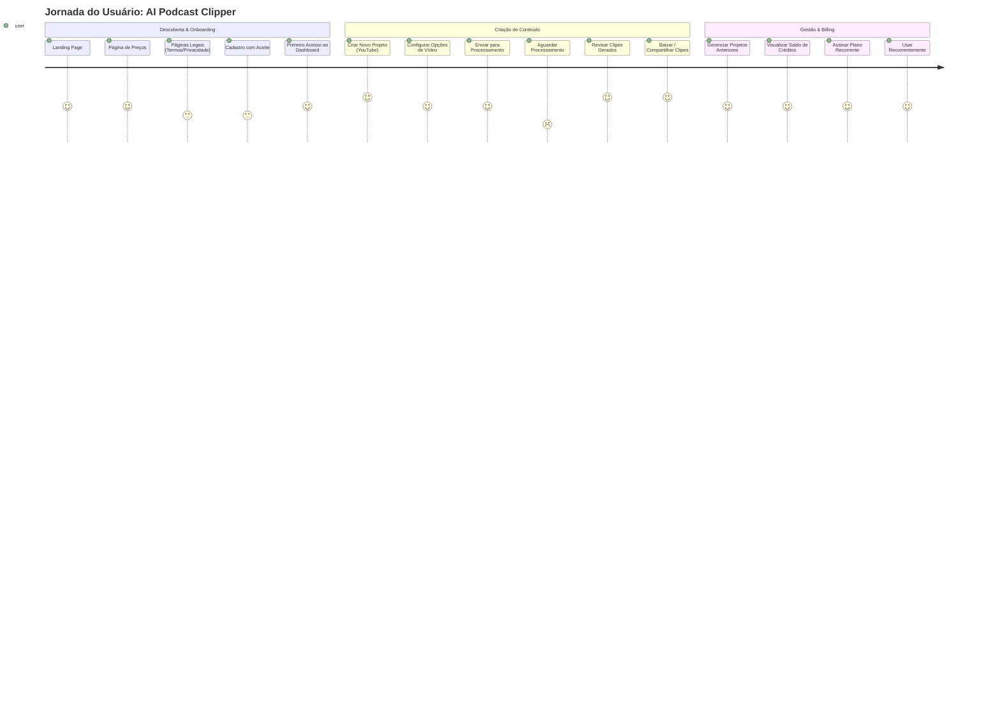

# Jornada do Usuário

Este documento mapeia a experiência do usuário no AI Podcast Clipper, desde o primeiro contato até o uso recorrente. Reflete as rotas e componentes reais do código (`src/app/**`, `src/components/**`).

## Visão Geral da Jornada

A jornada de um usuário percorre três fases principais: **Descoberta & Onboarding**, **Criação de Conteúdo** e **Gestão & Billing**. Cada fase tem pontos críticos de satisfação, erros esperados e caminhos alternativos.

### Diagrama de Satisfação (User Journey)



### Significado dos Scores

- **5**: Momento de alegria (clipes prontos, download bem-sucedido)
- **4**: Fluxo intuitivo (cadastro, criação de projeto, billing)
- **3**: Necessário mas com fricção (ler termos legais, esperar confirmação de email)
- **2**: Ponto de dor (esperar processamento, fila/loading state)

---

## Fluxo Detalhado de Navegação

```mermaid
flowchart TD
    Start([Usuário Novo])
    
    Start -->|Visita aioson.com| Landing["/: Landing Page"]
    Landing --> Header["Header: Logo, Links de Navegação"]
    Header -->|Clica Preços| Pricing["/pricing: Página de Preços"]
    Pricing -->|Clica Assinar| CheckAuth{Autenticado?}
    
    CheckAuth -->|Não| SignUp["/signup: Cadastro Clerk"]
    SignUp --> SignUpForm["Custom Sign-Up Form<br/>Email + Senha + Checkbox Termos/Privacidade"]
    SignUpForm -->|Clica Aceitar & Criar Conta| UserCreated["Usuário criado<br/>Clerk webhook sincroniza com DB"]
    
    Landing -->|Clica Footer: Termos| Terms["/terms: Termos de Serviço"]
    Landing -->|Clica Footer: Privacidade| Privacy["/privacy: Política de Privacidade"]
    Landing -->|Clica Footer: Reembolso| Refund["/refund: Política de Reembolso"]
    Landing -->|Clica Footer: Contato| Contact["/contact: Fale Conosco"]
    
    Terms --> CheckLegalContent{"Conteúdo<br/>completo?"}
    Privacy --> CheckLegalContent
    Refund --> CheckLegalContent
    Contact --> CheckLegalContent
    CheckLegalContent -->|Não| LegalTodo["Placeholder: [A PREENCHER]<br/>em alguns conteúdos"]
    LegalTodo --> BackToLanding["Volta ao navegador<br/>ou Footer"]
    
    CheckAuth -->|Sim| Dashboard["/dashboard: Dashboard Principal"]
    UserCreated --> Dashboard
    
    Landing -->|Usuário logado<br/>clica CTA| Dashboard
    
    Dashboard --> DashboardState{Estado do<br/>Dashboard?}
    
    DashboardState -->|Vazio, 1º acesso| FirstAccess["Estado Vazio<br/>Mensagem: Crie seu primeiro projeto"]
    FirstAccess --> CreateProjectBtn["Botão: Criar Novo Projeto"]
    
    DashboardState -->|Com projetos| RecentList["Lista: Vídeos Acessados Recentemente<br/>RecentVideosClient (ou InfiniteProjectsList em /dashboard/projects)"]
    RecentList --> ProjectAction["Clicar em Projeto Existente<br/>ou Criar Novo"]
    
    CreateProjectBtn --> NewProject["/dashboard/new: Criar Projeto"]
    ProjectAction -->|Clica em Projeto| ProjectDetails["/dashboard/projects/[id]:<br/>Detalhes do Projeto"]
    ProjectAction -->|Clica Criar Novo| NewProject
    
    NewProject --> YouTubeSection["Input: Colar URL do YouTube"]
    YouTubeSection --> FetchMeta["API: /api/youtube/info<br/>Busca metadata: título, duração"]
    FetchMeta --> MetadataLoaded["Thumbnail + Duração exibidos"]
    
    MetadataLoaded --> SliceConfig["Slice Configuration:<br/>Slider range (min/max) em minutos"]
    SliceConfig --> Options["Opções Dinâmicas:<br/>- GENRE (dropdown)<br/>- CLIP_MODEL (dropdown)<br/>- ASPECT_RATIO (dropdown)<br/>- AUTO_ZOOM (toggle)"]
    Options --> CreditEstimate["Estimativa de Créditos a Debitar"]
    
    CreditEstimate --> CheckCredits{Créditos<br/>suficientes?}
    
    CheckCredits -->|Não| InsufficientCredit["Toast Error:<br/>Créditos insuficientes"]
    InsufficientCredit --> BillingRedirect["Botão: Ir para Billing"]
    BillingRedirect --> Billing["/dashboard/billing: Planos & Créditos"]
    
    CheckCredits -->|Sim| SubmitBtn["Botão: Começar Processamento"]
    SubmitBtn --> ImportYT["Action: importYouTubeVideo()<br/>Cria UploadedFile<br/>Enfileira job Inngest"]
    ImportYT --> Processing["Status: Processing<br/>Toast: 'Vídeo enfileirado'"]
    
    Processing --> PollStatus["Client: Refetch via router.refresh()<br/>RecentVideosClient (Server Component)"]
    PollStatus --> Loading["Estado: QUEUED → PROCESSING → PROCESSED"]
    Loading --> ProcessingWait["Estado Spinner:<br/>Aguardando backend"]
    
    ProcessingWait --> ClipsReady{Processamento<br/>concluído?}
    
    ClipsReady -->|Erro no Backend| ProcessingError["Status: ERROR<br/>Toast: Exibe erro da API"]
    ProcessingError --> ErrorRecovery["Retry Button<br/>ou Criar novo projeto"]
    
    ClipsReady -->|Sucesso| ProjectDetails
    
    ProjectDetails --> ClipsList["Lista de Clips Gerados:<br/>Thumbnail, Viralidade, Título"]
    ClipsList --> ClipCard["Clip Card:<br/>- Título<br/>- Hook/Descrição<br/>- Virality Score<br/>- Botão Download<br/>- Botão Ver Detalhes"]
    
    ClipCard -->|Clica Download| Download["Download do arquivo MP4<br/>Sem marca d'água"]
    ClipCard -->|Clica Ver Detalhes| ClipModal["Clip Details Modal:<br/>- Metadata completa<br/>- Transcript<br/>- Botão Editar Legenda"]
    ClipCard -->|Clica Editar Legenda| EditModal["Clip Editor Modal:<br/>- Selector de preset<br/>- Salva alterações via updateClip"]
    ClipCard -->|Clica Agendar Publicação| ScheduleBtn["Botão: Agendar Publicação<br/>[Não funcional/Placeholder visual]"]
    ClipCard -->|Clica Excluir| DeleteModal["Confirmação:<br/>Excluir clipe permanentemente"]
    
    ProjectDetails -->|Voltar Dashboard| Dashboard
    ProjectDetails -->|Editar Projeto| EditProject["/dashboard/projects/[id]/edit:<br/>Ajustar configurações"]
    EditProject --> UpdateProject["Re-processar com<br/>novas opções"]
    UpdateProject --> Processing
    
    Dashboard -->|Clica Billing| Billing
    
    Billing --> ActiveSubCheck{Tem<br/>assinatura<br/>ativa?}
    
    ActiveSubCheck -->|Sim| ActiveCard["Active Subscription Card:<br/>- Plano (Starter/Pro)<br/>- Data de renovação<br/>- Créditos restantes"]
    ActiveCard --> ManageAction["Botão: Gerenciar Assinatura<br/>→ Portal Stripe"]
    
    ActiveSubCheck -->|Não| CreditStatus["Status de Créditos:<br/>- Total disponível<br/>- Créditos de assinatura<br/>(subscriptionCredits)"]
    CreditStatus --> PlansDisplay["Mostrar Planos:<br/>- Monthly vs Annual toggle<br/>- Starter: $15 ou $9.50/mês<br/>- Pro: $29 ou $19/mês"]
    
    PlansDisplay --> SelectPlan["Clicar em Plano"]
    SelectPlan --> Checkout["Action: createCheckoutSession(priceId)<br/>→ Stripe Checkout"]
    Checkout --> StripePayment["Usuário completa<br/>pagamento no Stripe"]
    StripePayment --> WebhookStripe["Webhook Stripe<br/>→ /api/webhooks/stripe"]
    WebhookStripe --> UpdateSub["Cria/Atualiza Subscription<br/>Adiciona subscriptionCredits"]
    UpdateSub --> ActivateSub["Status: active<br/>Créditos renovados"]
    ActivateSub --> BackToDash["Volta ao Dashboard"]
    
    ManageAction --> StripePortal["Portal Stripe:<br/>Atualizar cartão<br/>Cancelar assinatura<br/>Ver faturas"]
    StripePortal --> BackToDash
    
    BackToDash --> Recurrence["Usuário cria mais projetos<br/>com créditos renovados<br/>mensalmente/anualmente"]
    
    Recurrence --> BillingFailure{Pagamento<br/>falha?}
    
    BillingFailure -->|Sim| PaymentFailed["Subscription Status: past_due<br/>(Ver: visao-fluxo-pagamento.md)"]
    PaymentFailed --> Grace["Carência: 3 dias<br/>Créditos bloqueados"]
    Grace --> UserNotified["Email: Pagamento falhou<br/>Ação: Atualizar cartão no Portal"]
    
    BillingFailure -->|Não, renovado| Recurrence
```



---

## Fases Detalhadas

### 1. Descoberta & Onboarding

**Rotas**: `/` → `/pricing` → `/terms`, `/privacy`, `/refund`, `/contact` → `/signup`

| Componente | Responsabilidade | Rota |
|---|---|---|
| `Header` | Nav principal, logo, links de autenticação | `/` |
| `HeroSection` | Call-to-action principal, proposta de valor | `/` |
| `ProductPreview` | Demo visual / animação do produto | `/` |
| `ShowcaseCarousel` | Exemplos de clipes gerados | `/` |
| `ComparisonSection` | Comparação vs. edição manual | `/` |
| `Footer` | Links legais, redes sociais | todos |
| `PricingToggleTabs` | Monthly / Annual toggle | `/pricing` |
| `Custom Sign-Up Form` | Email, senha, checkbox Termos/Privacidade obrigatório | `/signup` |

**Fluxo de Erro**: 
- Se checkbox não marcado → aviso de validação
- Se email já existe → erro do Clerk
- Webhook Clerk sincroniza novo usuário com `db.user`

---

### 2. Criação de Conteúdo

**Rotas**: `/dashboard` → `/dashboard/new` → `/dashboard/projects/[id]` → `/dashboard/projects` (lista)

**Fluxo adicional de login social:**
- `/sso-callback`: Rota do Clerk (`AuthenticateWithRedirectCallback`) para completar login com Google/social

#### 2.1 Primeiro Acesso (Empty State)
- **Componente**: `RecentVideosClient` mostrando estado vazio
- **Estado**: Nenhum projeto anterior
- **Mensagem**: "Nenhum projeto recente."
- **CTA**: Botão "Criar Novo Projeto" disponível no layout

#### 2.2 Criar Novo Projeto

**Rota**: `/dashboard/new`
**Componentes**:
- `CreateProjectClient` (modo config, `isConfigRoute=true`)
- Input URL YouTube com debounce
- API: `/api/youtube/info` → fetch de metadata (título, duração, thumbnail)

**Opções Dinâmicas**:
```
GENRE
  └─ DOCUMENTARY, COMEDY, EDUCATIONAL, MOTIVATIONAL, etc.
CLIP_MODEL
  └─ VIRALITY (padrão), CONSISTENCY, BALANCED
ASPECT_RATIO
  └─ 9:16 (default), 16:9, 1:1
AUTO_ZOOM
  └─ toggle (default: true)
```

(Busca de opções: `getProcessingOptions()` → `ProcessingOption` tabela)

#### 2.3 Configuração do Slice
- **Slider Range**: min = 0, max = duração do vídeo (em minutos)
- **Padrão**: primeiros 5 minutos ou duração do vídeo, se menor

#### 2.4 Estimativa de Créditos
- Backend calcula (baseado no `clipModel`, duração do slice)
- **Se insuficientes**:
  - Toast: "Créditos insuficientes"
  - Botão: "Ir para Billing" → `/dashboard/billing`

#### 2.5 Submissão
- **Action**: `importYouTubeVideo()`
- **Cria**: `UploadedFile` com `status = 'queued'`
- **Enfileira**: Job Inngest
- **Toast**: "Vídeo enfileirado"
- **Redirecionamento**: usuário vê lista de projetos/estado vazio com polling

#### 2.6 Aguardando Processamento
- **Componente**: `RecentVideosClient`
- **Polling**: `setInterval` chama `router.refresh()` (refetch do Server Component, `recent-videos-client.tsx:64-75`) — não é uma rota de API dedicada
- **Estados**:
  - `QUEUED`: em fila do Inngest
  - `PROCESSING`: GPU/backend processando
  - `PROCESSED`: clips prontos
  - `ERROR`: falha no pipeline (ver detalhes em `./visao-fluxo-processamento-video.md`)

#### 2.7 Revisar Clipes Gerados

**Rota**: `/dashboard/projects/[id]`
**Componentes**:
- `RecentVideosClient` (em modo detalhes)
- `ClipCard` (cada clipe gerado)
  - Thumbnail (frame do clipe)
  - Título (gerado automaticamente ou editável)
  - Hook (trecho inicial, para social)
  - Virality Score (0.0–1.0, calculado pelo Gemini)
  - Botão: Download (MP4, sem marca d'água → S3)
  - Botão: "Ver Detalhes"

- `ClipDetailsModal` (ao clicar "Ver Detalhes")
  - Metadata completa (timestamps, duração, aspectRatio, subtitle preset)
  - Transcript (palavras com timestamps)
  - Botão: "Editar" (abre `ClipEditorModal` — placeholder para edição de legenda/crop)

#### 2.8 Gerenciar Projetos

**Rota**: `/dashboard/projects` (lista) ou `/dashboard/projects/[id]/edit`

| Ação | Descrição | Componente |
|---|---|---|
| Renomear | Editar `displayName` do `UploadedFile` | Dialog/AlertDialog inline em `RecentVideosClient` |
| Reprocessar | Mudar opções (GENRE, etc.) e re-enfileirar | `CreateProjectClient` em modo edit |
| Deletar | Hard-delete do `UploadedFile` e clipes relacionados (+ arquivos S3) | AlertDialog inline em `RecentVideosClient` |

---

### 3. Gestão & Billing

**Rota**: `/dashboard/billing`

#### 3.1 Status de Créditos
- **Card 1**: "Saldo Total Disponível" = `user.credits` (soma de todos os tipos)
- **Card 2**: "Cota de Assinatura" = `user.subscriptionCredits` (renovado mensalmente/anualmente)

#### 3.2 Assinatura Ativa
Se `subscription.status = 'active'` ou `'past_due'`:
- **Component**: `ActiveSubscriptionCard`
- **Info**:
  - Plano (Starter / Pro)
  - Data de renovação (`currentPeriodEnd`)
  - Créditos restantes antes da renovação
  - Botão: "Gerenciar Assinatura" → Portal Stripe

#### 3.3 Selecionar Plano
- **Toggle**: Monthly / Annual
- **Planos Disponíveis**:
  - **Starter Monthly**: $15/mês, 150 créditos/mês
  - **Starter Annual**: $114/ano ($9.50/mês), 1.800 créditos/ano
  - **Pro Monthly**: $29/mês, 300 créditos/mês
  - **Pro Annual**: $228/ano ($19/mês), 3.600 créditos/ano

#### 3.4 Checkout
- **Action**: `createCheckoutSession(priceId)`
- **Integração**: Stripe Checkout
- **Webhook**: `/api/webhooks/stripe` (webhook do Stripe)
  - Cria/atualiza `Subscription`
  - Adiciona `subscriptionCredits` ao usuário
  - Status: `active` ou `past_due`

#### 3.5 Falha de Pagamento
- **Trigger**: Webhook Stripe `invoice.payment_failed`
- **Estado**: `subscription.status = 'past_due'`
- **Ação Automática**: Carência de 3 dias (ver **`./visao-fluxo-pagamento.md`** para detalhe)
- **User Action**: Email notificando falha → Atualizar cartão no Portal Stripe → Retry automático

---

## Componentes-chave Mapeados

| Componente | Arquivo | Responsabilidade |
|---|---|---|
| `Header` | `src/components/landing/header.tsx` | Nav landing, logo, CTA |
| `Footer` | `src/components/landing/footer.tsx` | Links legais, redes |
| `CreateProjectClient` | `src/components/dashboard/create-project-client.tsx` | Criar/editar projeto, opções dinâmicas, slice config |
| `RecentVideosClient` | `src/components/dashboard/recent-videos-client.tsx` | Polling de status, lista de vídeos |
| `ClipCard` | `src/components/clip-card.tsx` | Exibição de clipe individual |
| `ClipDetailsModal` | `src/components/clip-details-modal.tsx` | Detalhes completos do clipe |
| `ClipEditorModal` | `src/components/clip-editor-modal.tsx` | Editor de preset de legenda |
| `PricingToggleTabs` | `src/components/billing/pricing-toggle-tabs.tsx` | Monthly/Annual toggle |
| `ActiveSubscriptionCard` | `src/components/billing/active-subscription-card.tsx` | Card de assinatura ativa |
| `AppSidebar` | `src/components/dashboard/sidebar/app-sidebar.tsx` | Navegação lateral do dashboard |
| `AccountSwitcher` | `src/components/dashboard/header/account-switcher.tsx` | Usuário logado, opções de conta |

---

## Rotas Mapeadas

| Rota | Arquivo | Descrição |
|---|---|---|
| `/` | `app/page.tsx` | Landing page |
| `/pricing` | `app/pricing/page.tsx` | Página de preços |
| `/terms` | `app/terms/page.tsx` | Termos de Serviço |
| `/privacy` | `app/privacy/page.tsx` | Política de Privacidade |
| `/refund` | `app/refund/page.tsx` | Política de Reembolso |
| `/contact` | `app/contact/page.tsx` | Formulário de contato |
| `/signup/[[...signup]]` | `app/signup/[[...signup]]/page.tsx` | Cadastro (Clerk) |
| `/login/[[...login]]` | `app/login/[[...login]]/page.tsx` | Login (Clerk) |
| `/` | `app/page.tsx` | Landing page |
| `/pricing` | `app/pricing/page.tsx` | Página de preços |
| `/terms` | `app/terms/page.tsx` | Termos de Serviço |
| `/privacy` | `app/privacy/page.tsx` | Política de Privacidade |
| `/refund` | `app/refund/page.tsx` | Política de Reembolso |
| `/contact` | `app/contact/page.tsx` | Formulário de contato |
| `/signup/[[...signup]]` | `app/signup/[[...signup]]/page.tsx` | Cadastro (Clerk) |
| `/login/[[...login]]` | `app/login/[[...login]]/page.tsx` | Login (Clerk) |
| `/sso-callback` | `app/sso-callback/page.tsx` | Callback de SSO (Google login) |
| `/dashboard` | `app/dashboard/page.tsx` | Dashboard principal (início, recent videos) |
| `/dashboard/new` | `app/dashboard/new/page.tsx` | Criar novo projeto |
| `/dashboard/projects` | `app/dashboard/projects/page.tsx` | Lista de projetos |
| `/dashboard/projects/[id]` | `app/dashboard/projects/[id]/page.tsx` | Detalhes do projeto (clipes gerados) |
| `/dashboard/projects/[id]/edit` | `app/dashboard/projects/[id]/edit/page.tsx` | Editar projeto (reprocessar) |
| `/dashboard/billing` | `app/dashboard/billing/page.tsx` | Gerenciar billing e assinatura |
| `/api/youtube/info` | `app/api/youtube/info/route.ts` | Buscar metadata de vídeo YouTube |
| `/api/webhooks/stripe` | `app/api/webhooks/stripe/route.ts` | Webhook de eventos Stripe |
| `/api/webhooks/clerk` | `app/api/webhooks/clerk/route.ts` | Webhook de eventos Clerk |

---

## Referência Cruzada com Outros Documentos

Este documento é complementado por:

1. **`visao-dados-modelo-er.md`** — Modelo de dados (entidades User, UploadedFile, Clip, Subscription, CreditTransaction)
2. **`visao-fluxo-pagamento.md`** — Detalhe técnico de billing, webhook Stripe, carência de pagamento, créditos hold/consume/refund (a documentar)
3. **`visao-fluxo-processamento-video.md`** — Pipeline de vídeo, transcrição, detecção de falante, geração de legendas, renderização (a documentar)

---

## Notas Importantes

- **Upload Direto**: Escondido na UI (decisão de produto). Fluxo atual é YouTube-only + cortes manuais por timestamp.
- **Conteúdo Legal**: Alguns placeholders `[A PREENCHER]` ainda existem em `/terms`, `/privacy`, `/refund`, `/contact`.
- **Checkpoint de Créditos**: Antes de enviar para processamento, o sistema verifica se `user.credits >= estimatedCost`. Se não, redireciona para billing.
- **Webhook Clerk**: Sincroniza novo usuário com `db.user` automaticamente ao cadastro.
- **Polling**: O frontend faz polling contínuo em `RecentVideosClient` enquanto vídeo está em `QUEUED` ou `PROCESSING`.
- **Deduplicação de Webhook**: `ProcessedWebhookEvent` previne double-processing de eventos Stripe/Clerk.
