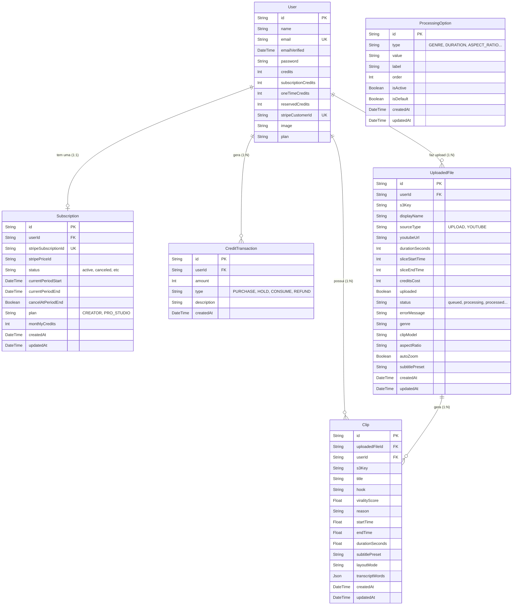

# Arquitetura do Banco de Dados

Este diagrama reflete a estrutura atual do seu banco de dados, configurada no `schema.prisma`.

## Resumo das Entidades Principais

- **`User` e `Subscription`**: Gerenciam o acesso, autenticação e dados do Stripe. O sistema de créditos foi fragmentado de forma robusta (`subscriptionCredits`, `oneTimeCredits` e `reservedCredits`) para suportar a arquitetura de "hold" do processamento.
- **`CreditTransaction`**: Ledger (Livro-razão) de créditos, documentando com segurança cada pacote comprado, saldo reservado ou estornado por falha.
- **`UploadedFile`**: Representa um "Projeto/Vídeo Base", seja upado direto ou baixado do YouTube. Contém o status do processamento para gerenciar a fila do Inngest.
- **`Clip`**: Os cortes finais em formato 9:16 gerados pelo seu novo Backend GPU local, relacionados diretamente ao arquivo base que os originou e contendo métricas de *virality score* calculadas pela IA.
- **`ProcessingOption`**: Tabela de parametrização global (para renderizar dinamicamente estilos de legenda, modelos de IA e formatos na UI).
