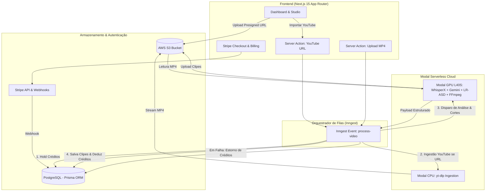

# Design Document: AI Podcast Clipper Pro

- **Data**: 2026-09-10
- **Status**: Aprovado para Planejamento de Implementação
- **Escopo**: Refatoração arquitetural, segurança, automação e nova UX para lançamento comercial do SaaS.

---

## 1. Visão Geral e Objetivos

Transformar o protótipo do **AI Podcast Clipper** em um produto SaaS comercial (**AI Podcast Clipper Pro**) de alta confiabilidade, escalável, seguro contra explorações financeiras e com excelente experiência do usuário.

### 1.1 Objetivos de Negócio
- **Modelo de Monetização**: Pay-as-you-go baseado em créditos (1 crédito = 1 minuto de vídeo original processado).
- **Entrada Flexível**: Upload direto de arquivos `.mp4` / `.mov` e importação direta por links públicos do YouTube.
- **Diferenciais Competitivos**:
  - Detecção ativa de oradores (Active Speaker Detection - LR-ASD) com reenquadramento inteligente 9:16.
  - Análise de momentos virais com Gemini 2.5 Flash gerando títulos persuasivos, hooks e scores de viralidade.
  - Legendas estilizadas dinâmicas com presets visuais (*Hormozi*, *Minimal*, *Neon*).
  - Ajuste rápido de texto e re-renderização em segundos.

### 1.2 Princípios Arquiteturais
- **Custo Quase Zero Ocioso**: Processamento em GPU NVIDIA L40S via Modal acionado sob demanda com desligamento rápido.
- **Segurança Transacional**: Débito atômico de créditos com retenção prévia (hold) e estorno 100% garantido em caso de falha.
- **Eficiência de Recursos**: Download de links do YouTube em containers CPU (sem queimar GPU durante download de rede).
- **Zero Varredura Cega**: Comunicação estrita entre backend e orquestrador via contratos JSON tipados.

---

## 2. Arquitetura do Sistema



---

## 3. Especificações Técnicas por Camada

### 3.1 Camada de Dados e Finanças (Prisma & PostgreSQL)

#### Modificações no Schema
1. **Remoção**: Eliminação definitiva do modelo de template `Post`.
2. **Atualização em `User`**:
   - `credits`: `Int` (saldo livre disponível).
   - `reservedCredits`: `Int @default(0)` (saldo retido em jobs ativos).
3. **Atualização em `UploadedFile`**:
   - `sourceType`: `String` (`"UPLOAD"` | `"YOUTUBE"`).
   - `youtubeUrl`: `String?`.
   - `durationSeconds`: `Int @default(0)`.
   - `creditsCost`: `Int @default(0)`.
   - `status`: `String @default("QUEUED")` (`"QUEUED"`, `"DOWNLOADING"`, `"PROCESSING"`, `"PROCESSED"`, `"FAILED"`).
   - `errorMessage`: `String?`.
4. **Atualização em `Clip`**:
   - `title`: `String`.
   - `hook`: `String`.
   - `viralityScore`: `Float`.
   - `reason`: `String`.
   - `startTime`: `Float`.
   - `endTime`: `Float`.
   - `durationSeconds`: `Float`.
   - `subtitlePreset`: `String @default("HORMOZI")`.
   - `layoutMode`: `String @default("SMART_CROP")`.
   - `transcriptWords`: `Json?` (array de palavras e timestamps).
5. **Novo Modelo `CreditTransaction`**:
   - `id`: `String @id @default(cuid())`.
   - `userId`: `String`.
   - `amount`: `Int`.
   - `type`: `String` (`"PURCHASE"` | `"HOLD"` | `"CONSUME"` | `"REFUND"`).
   - `description`: `String`.
   - `createdAt`: `DateTime @default(now())`.

#### Algoritmo de Transação Atômica de Créditos
```ts
// 1. Reserva no disparo
await db.$transaction(async (tx) => {
  const user = await tx.user.findUniqueOrThrow({ where: { id: userId } });
  const required = Math.ceil(durationSeconds / 60);
  if (user.credits < required) {
    throw new Error("Saldo insuficiente de créditos");
  }
  await tx.user.update({
    where: { id: userId },
    data: {
      credits: { decrement: required },
      reservedCredits: { increment: required }
    }
  });
  await tx.creditTransaction.create({
    data: { userId, amount: required, type: "HOLD", description: `Reserva para vídeo ${fileId}` }
  });
});
```

---

### 3.2 Pipeline de IA & Worker Modal (Python)

#### 1. Ingestão do YouTube (Modal CPU)
- Executa em container leve Debian (`modal.Image.debian_slim().pip_install(["yt-dlp", "boto3"])`).
- Extrai metadados via `yt-dlp`: título, thumbnail e duração em segundos.
- Baixa o melhor stream combinado (máximo 1080p H.264) e transmite diretamente para o bucket S3 em `${fileId}/original.mp4`.

#### 2. Pipeline de Processamento (Modal GPU L40S)
- **Container**: `nvidia/cuda:12.4.0-devel-ubuntu22.04` com Python 3.12, PyTorch, FFmpeg, WhisperX e OpenCV.
- **Etapa 1: Áudio**: Extração para WAV 16kHz mono.
- **Etapa 2: WhisperX**:
  - Modelo `large-v2` com `float16` em CUDA.
  - Alinhamento fonético com `whisperx.load_align_model` produzindo `word_segments`.
- **Etapa 3: Gemini 2.5 Flash com Structured Outputs**:
  - Uso obrigatório de `response_mime_type="application/json"` e `response_schema=MomentsExtraction`.
  - Regra de prompts: cortes de 30s a 60s focados em histórias e Q&A, com notas de viralidade de 1 a 10.
- **Etapa 4: Active Speaker Detection (LR-ASD)**:
  - O corte do vídeo original é feito **apenas** para o intervalo `[start, end]` de cada clipe selecionado.
  - `Columbia_test.py` roda somente no trecho recortado, economizando mais de 80% de tempo e I/O.
- **Etapa 5: Renderização e Legendas**:
  - Enquadramento 9:16 com orador centrado via `ffmpegcv.VideoWriterNV`.
  - Fallback com fundo desfocado quando o score do orador for negativo.
  - Geração de legendas ASS via `pysubs2` nos presets:
    - `HORMOZI`: Anton 140, maiúsculas, realce amarelo, contorno 2.5px.
    - `MINIMAL`: Inter / Sans, estilo moderno minimalista com caixa semitransparente.
    - `NEON`: Alto contraste com contorno vibrante.
  - Queima das legendas via FFmpeg e upload imediato para S3 em `${fileId}/clips/clip_${index}.mp4`.
- **Contrato de Retorno do Endpoint**:
  ```json
  {
    "success": true,
    "fileId": "cuid...",
    "clips": [
      {
        "index": 0,
        "s3Key": "cuid.../clips/clip_0.mp4",
        "title": "A verdade sobre...",
        "hook": "Você nunca imaginaria isso!",
        "viralityScore": 9.4,
        "reason": "História com alto valor emocional",
        "start": 12.0,
        "end": 55.4,
        "duration": 43.4,
        "words": [...]
      }
    ]
  }
  ```

---

### 3.3 Orquestrador Inngest & Governança de Storage

#### Fluxo da Função `process-video`
1. `validate-and-hold`: Valida a duração do vídeo e realiza a transação de reserva no banco.
2. `download-youtube`: Caso `sourceType === "YOUTUBE"`, chama a função Modal CPU e aguarda o upload no S3.
3. `mark-processing`: Atualiza o status do vídeo para `"PROCESSING"`.
4. `call-gpu-worker`: Envia requisição autenticada ao Modal GPU com timeout estendido.
5. `save-clips`: Cria os registros `Clip` no PostgreSQL com base no array retornado pelo Modal.
6. `commit-credits`: Converte o HOLD em CONSUME e atualiza status para `"PROCESSED"`.
7. `onFailure`: Em qualquer exceção não tratada, estorna 100% dos créditos retidos para o usuário e grava a mensagem de erro em `UploadedFile.errorMessage`.

#### Governança S3 e Limpeza
- **S3 Lifecycle Rule**: Chaves com padrão `*/original.mp4` expiram após 7 dias.
- **Delete Action**: Excluir vídeo ou clipe no dashboard aciona `DeleteObjectsCommand` na AWS SDK.

---

### 3.4 Frontend & Experiência do Usuário (Next.js 15)

1. **Importador Duplo**:
   - **Upload Local**: Dropzone para MP4/MOV com inspeção de duração prévia via elemento `<video>` em memória.
   - **YouTube URL**: Input com validação de formato e preview de metadados antes de submeter.
2. **Dashboard com Polling Reativo Inteligente**:
   - Hook de polling acionado enquanto houver arquivos em `"DOWNLOADING"` ou `"PROCESSING"`.
   - Indicador de progresso com steps visuais.
   - Atualização automática sem necessidade de recarregar a página.
3. **Studio de Clipes**:
   - Grade responsiva com player de vídeo 9:16.
   - Exibição de Título e Hook sugeridos prontos para copiar.
   - Badge com Score de Viralidade.
   - Modal de Edição Rápida:
     - Correção ortográfica de palavras da legenda.
     - Seletor de estilo visual (Hormozi, Minimal, Neon).
     - Botão de re-renderização instantânea.
   - Download direto em MP4 Full HD.

---

## 4. Plano de Fases para Implementação

- **Fase 1: Fundação de Dados e Segurança**:
  - Limpeza do schema Prisma (remover `Post`, adicionar transações de crédito, `CreditTransaction`, campos de metadados em `Clip` e `UploadedFile`).
  - Atualização do `env.js` para remover dependências hardcoded.
- **Fase 2: Refatoração do Backend Python (Modal)**:
  - Adição do módulo `yt-dlp` em container CPU.
  - Implementação de Pydantic Structured Outputs no Gemini 2.5 Flash.
  - Otimização do LR-ASD para rodar apenas nos trechos dos clipes.
  - Módulo de presets visuais de legendas com `pysubs2`.
- **Fase 3: Orquestração Resiliente (Inngest)**:
  - Reescrever `inngest/functions.ts` com reserva atômica de créditos, estorno no `onFailure` e persistência orientada ao payload do Modal.
- **Fase 4: Nova Interface e Studio (Frontend Next.js)**:
  - Formulário com abas de Upload e Link do YouTube.
  - Polling reativo no dashboard.
  - Player vertical com score, hook e modal de edição rápida.
- **Fase 5: Faturamento e Verificação de Produção**:
  - Validação ponta a ponta do Stripe Checkout e Webhooks.
  - Testes com podcasts reais do YouTube e uploads locais.
