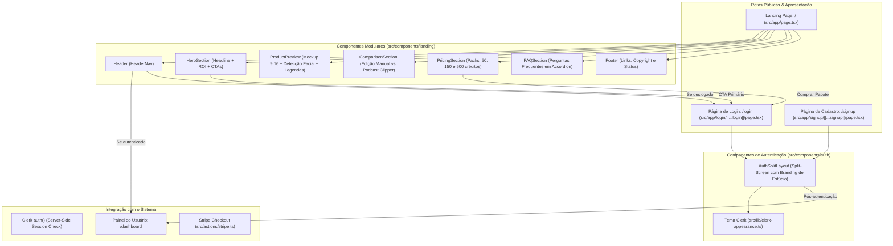

# Especificação Técnica: Landing Page de Vendas & Experiência de Login Minimalista (Dark Precision Studio)

- **Data:** 13 de Setembro de 2026
- **Status:** Aprovado para Planejamento de Implementação
- **Autor:** Antigravity + Usuário
- **Escopo:** Criação da página pública de vendas e apresentação (`/`) e redesenho das telas de autenticação (`/login` e `/signup`) com identidade visual minimalista autêntica ("Dark Precision Studio"), fugindo expressamente de clichês visuais de IA e destacando o valor real de produtividade para criadores de podcasts.

---

## 1. Visão Geral e Filosofia "Anti-IA"

A maioria esmagadora dos produtos SaaS de IA atuais sofre de uma fadiga estética evidente:
- Gradientes espalhafatosos roxos e azuis neon.
- Orbes flutuantes com `blur-3xl` excessivo que poluem a tela.
- Ilustrações 3D genéricas ou avatares flutuantes sem propósito funcional.
- Microcopy vazia repleta de buzzwords ("Transforme seu fluxo com o poder supremo da inteligência artificial").

### 1.1 Princípios de Design "Dark Precision Studio"
1. **Estética de Equipamento Profissional de Estúdio:** Inspirado no minimalismo funcional e de alta precisão de marcas como Teenage Engineering, Linear e Ableton.
2. **Paleta Neutra Fosca e de Alto Contraste:**
   - Fundo base: `zinc-950` (`#09090b`), com superfícies de cartões em `zinc-900/40` e divisores de linha milimétricos `border-zinc-800/70`.
   - Textos em alto contraste `zinc-100`, `zinc-400` e notas técnicas em `zinc-500`.
   - Acento sutil e funcional de gravação: Ponto `[ ● REC ]` em vermelho carmesim discreto e detalhes âmbar suaves de estúdio, sem nenhum gradiente roxo/neon.
3. **Tipografia Nítida e Editorial:**
   - Títulos em `Geist Sans` com espaçamento reduzido (`tracking-tight`), pesos `font-medium` a `font-semibold`.
   - Dados de processamento, timecodes de corte (`00:14:22 → 00:15:08`), duração e pontuações virais expressos em `Geist Mono` (`font-mono text-xs`).
4. **Demonstração do Produto Real (Sem Promessas Falsas):**
   - O mockup exibe a verdadeira transformação do produto: um vídeo horizontal (16:9) recortado dinamicamente no interlocutor ativo para o formato vertical (9:16) com legendas dinâmicas ativas sincronizadas.
5. **Comunicação Direta focada em ROI (Tempo & Custo):**
   - Microcopy em português brasileiro (pt-BR) direcionada à dor real do criador: "1 hora de podcast. 5 cortes verticais prontos em 3 minutos, sem abrir o Premiere."

---

## 2. Arquitetura da Solução



---

## 3. Detalhamento das Seções da Landing Page (`/`)

### 3.1 Header Fixo de Navegação (`src/components/landing/header.tsx`)
- **Posição:** Fixo no topo (`sticky top-0 z-50 backdrop-blur-md bg-zinc-950/80 border-b border-zinc-800/50`).
- **Logo:** Ícone vetorial estilizado de fita/corte com a tipografia `Podcast Clipper` e uma badge minimalista `STUDIO` em `bg-zinc-800 text-zinc-300 text-[10px] font-mono px-1.5 py-0.5 rounded`.
- **Links de Navegação Rápida:** Âncoras suaves para `#demonstracao`, `#comparativo`, `#precos` e `#faq`.
- **Ações de Usuário:**
  - Se autenticado: Botão direto com borda sutil `[ Acessar Painel → ]` direcionando para `/dashboard`.
  - Se deslogado: Link sutil `Entrar` direcionando para `/login` e botão primário `[ Começar Agora ]` direcionando para `/signup`.

### 3.2 Hero Section (`src/components/landing/hero-section.tsx`)
- **Badge de Topo:**
  - `[ ● REC ] Processamento Inteligente em 9:16`. Ponto vermelho sutil com leve pulso, transmitindo atmosfera de estúdio ativo.
- **Headline:**
  - `De podcasts longos a cortes virais. Em 3 minutos, sem abrir o Premiere.`
- **Subheadline:**
  - `Cole o link do YouTube. Nossa engine detecta os momentos de maior retenção, reenquadra automaticamente os participantes em 9:16 e gera legendas dinâmicas sincronizadas prontas para TikTok, Reels e Shorts.`
- **Call-To-Actions (CTAs):**
  - Botão Primário: `[ Criar Meus Primeiros Cortes → ]` (alto contraste: `bg-zinc-100 text-zinc-950 hover:bg-zinc-200 font-medium px-6 py-3 rounded-lg shadow-sm`).
  - Botão Secundário: `[ Ver Exemplo de Corte ↓ ]` (borda sutil: `border border-zinc-800 text-zinc-300 hover:bg-zinc-900 px-5 py-3 rounded-lg`).
- **Micro-prova e Métricas de Confiança:**
  - "10 créditos gratuitos no cadastro • Sem cartão de crédito obrigatório • Download em 1080p".

### 3.3 Demonstração Real do Produto (`src/components/landing/product-preview.tsx`)
- **Conceito:** Uma réplica interativa e realista do resultado gerado pela plataforma, sem ilustrações abstratas.
- **Estrutura Visual:**
  - Card central em moldura de precisão (`border border-zinc-800 bg-zinc-900/30 rounded-xl p-4 md:p-6`).
  - **Painel Superior / Fonte:**
    - Miniatura de vídeo horizontal 16:9 simulando episódio de estúdio ("Episódio #42 - Estratégias de Crescimento").
    - Timeline de áudio com marcadores de trecho identificado (`00:14:22 → 00:15:08`).
  - **Painel Central / Corte Gerado:**
    - Exibição de um mockup em proporção vertical 9:16 simulando tela de smartphone.
    - Câmera reenquadrada com foco inteligente no interlocutor.
    - Legendas ativas estilo viral com palavra atual destacada em amarelo/branco.
    - Metadados técnicos no rodapé do player:
      - `Score Viral: 94/100` (calculado por retenção e intensidade vocal).
      - `Duração: 46s`.
      - `Taxa de quadros: 60 FPS`.
      - `Badge: Pronto para download`.

### 3.4 Comparativo "Edição Manual vs. Podcast Clipper" (`src/components/landing/comparison-section.tsx`)
- **Tabela comparativa direta:**
  | Critério | Edição Manual Tradicional | Com o Podcast Clipper |
  | :--- | :--- | :--- |
  | **Tempo por Episódio** | 3 a 5 horas garimpando trechos no Premiere/CapCut | **Menos de 3 minutos** totalmente automatizado |
  | **Custo por Corte** | R$ 50 a R$ 150 por vídeo com editores freelancers | **Menos de R$ 1,00** por corte finalizado |
  | **Enquadramento 9:16** | Keyframes manuais para cada convidado | **Detecção facial automática** de quem fala |
  | **Legendas Dinâmicas** | Digitação, revisão e sincronização manual | **Transcrição nativa com alta precisão pt-BR** |
  | **Escala de Postagem** | 2 a 3 cortes por semana | **10 a 20 cortes semanais** sem esforço extra |

### 3.5 Tabela de Preços Transparente (`src/components/landing/pricing-section.tsx`)
- **Modelo de Cobrança:** Pay-As-You-Go (créditos avulsos sem assinatura mensal obrigatória).
- **Pacotes integrados com o Stripe:**
  1. **Pack Inicial:**
     - Preço: `$9.99` (~R$ 50).
     - Volume: `50 créditos` (~50 minutos de vídeo processado).
     - Para quem: Criadores iniciantes que desejam testar em 1 episódio.
  2. **Pack Criador (Mais Popular):**
     - Preço: `$24.99` (~R$ 130).
     - Volume: `150 créditos` (~3 episódios completos).
     - Destaque: `Economia de 17%`.
     - Badge sutil: `Recomendado`.
  3. **Pack Estúdio:**
     - Preço: `$69.99` (~R$ 380).
     - Volume: `500 créditos` (~10 episódios).
     - Destaque: `Economia de 30%`.
     - Para quem: Agências de mídia e podcasts com transmissões semanais.
- **Garantia explícita:** *"Créditos nunca expiram. Use no seu próprio ritmo, semana após semana."*

### 3.6 FAQ - Dúvidas Frequentes (`src/components/landing/faq-section.tsx`)
- Accordion minimalista com animação suave e limpa:
  - *Como são calculados os créditos?* 1 crédito equivale a 1 minuto de vídeo analisado e fatiado.
  - *Os créditos têm prazo de validade?* Não. Diferente de outros serviços que zeram seus créditos todo mês, aqui o que você compra é seu para sempre.
  - *O reconhecimento de fala funciona bem em português?* Sim. Nosso pipeline utiliza modelos de alta precisão calibrados para sotaques, gírias e pontuação em português do Brasil.
  - *Quais formatos de vídeo posso importar?* Basta colar qualquer link público ou não listado do YouTube.

### 3.7 Footer Minimalista (`src/components/landing/footer.tsx`)
- Status do serviço: `● Todos os sistemas operacionais (AWS + Cloudflare)`.
- Links institucionais: Termos de Serviço, Política de Privacidade e Suporte via e-mail.
- Copyright: `© 2026 Podcast Clipper Studio. Todos os direitos reservados.`

---

## 4. Experiência de Autenticação (`/login` e `/signup`)

### 4.1 Layout Split-Screen (`src/components/auth/auth-split-layout.tsx`)
- **Desktop (2 colunas equilibradas):**
  - **Coluna da Esquerda (Branding e Contexto de Estúdio):**
    - Logo com link rápido: `← Voltar para o site`.
    - Chamada editorial: *"A ferramenta definitiva para transformar podcasts longos em canais de alto engajamento."*
    - Mockup vertical compacto do corte com waveform de áudio animado de forma discreta.
    - Depoimento real: *"Aumentamos nosso alcance em mais de 300% no TikTok e Reels apenas reaproveitando as conversas que já gravávamos."*
    - Selo de confiança: Criptografia de ponta a ponta e processamento em nuvem isolada.
  - **Coluna da Direita (Formulário de Entrada):**
    - Espaço limpo, centrado, sem caixas flutuantes com sombras pesadas.
    - Renderização nativa do componente do Clerk (`<SignIn />` ou `<SignUp />`).
- **Mobile:**
  - Layout empilhado limpo, exibindo o logo e link de retorno no topo e o formulário focado no centro da tela.

### 4.2 Customização da `appearance` do Clerk (`src/lib/clerk-appearance.ts`)
Definição unificada de estilo aplicada ao `<SignIn />` e `<SignUp />`:
```typescript
import { dark } from "@clerk/themes";
import type { Appearance } from "@clerk/types";

export const studioClerkAppearance: Appearance = {
  baseTheme: dark,
  variables: {
    colorPrimary: "#ffffff",
    colorTextOnPrimaryBackground: "#09090b",
    colorBackground: "#09090b",
    colorInputBackground: "#18181b",
    colorInputText: "#f4f4f5",
    colorText: "#f4f4f5",
    colorTextSecondary: "#a1a1aa",
    colorBorder: "#27272a",
    borderRadius: "0.5rem",
    fontFamily: "var(--font-geist-sans)",
  },
  elements: {
    card: "bg-zinc-950 border border-zinc-800/80 shadow-none rounded-xl",
    headerTitle: "text-zinc-100 font-semibold tracking-tight text-xl",
    headerSubtitle: "text-zinc-400 text-sm",
    socialButtonsBlockButton: "bg-zinc-900 hover:bg-zinc-800 border border-zinc-800 text-zinc-200 transition-colors",
    formButtonPrimary: "bg-zinc-100 text-zinc-950 hover:bg-zinc-200 font-medium transition-colors shadow-none",
    formFieldInput: "bg-zinc-900/80 border-zinc-800 focus:border-zinc-500 text-zinc-100 placeholder:text-zinc-600 transition-colors",
    footerActionLink: "text-zinc-300 hover:text-white underline-offset-4",
  },
};
```

---

## 5. Estratégia de Implementação e Verificação

### 5.1 Arquivos a Criar e Modificar
1. `src/lib/clerk-appearance.ts` *(Novo)*: Estilização do Clerk centralizada.
2. `src/components/auth/auth-split-layout.tsx` *(Novo)*: Componente de layout split-screen.
3. `src/components/landing/header.tsx` *(Novo)*: Barra de navegação com verificação de sessão.
4. `src/components/landing/hero-section.tsx` *(Novo)*: Seção Hero com ROI e badges de estúdio.
5. `src/components/landing/product-preview.tsx` *(Novo)*: Demonstração autêntica de corte 9:16.
6. `src/components/landing/comparison-section.tsx` *(Novo)*: Tabela comparativa "Manual vs. Clipper".
7. `src/components/landing/pricing-section.tsx` *(Novo)*: Tabela dos pacotes de créditos.
8. `src/components/landing/faq-section.tsx` *(Novo)*: Accordion com respostas às dúvidas frequentes.
9. `src/components/landing/footer.tsx` *(Novo)*: Rodapé minimalista.
10. `src/app/page.tsx` *(Modificação)*: Substituir redirecionamento cego por montagem da Landing Page completa.
11. `src/app/login/[[...login]]/page.tsx` *(Modificação)*: Integrar `AuthSplitLayout` e `studioClerkAppearance`.
12. `src/app/signup/[[...signup]]/page.tsx` *(Modificação)*: Integrar `AuthSplitLayout` e `studioClerkAppearance`.

### 5.2 Critérios de Sucesso e Testes
- **Testes Unitários:**
  - Testes de renderização para a Landing Page e seus componentes em `src/components/landing/__tests__/`.
  - Testes do `AuthSplitLayout` em `src/components/auth/__tests__/`.
- **Verificação Estática:**
  - `npm run check` com 0 erros de TypeScript e 0 erros/warnings impeditivos de ESLint.
- **Suíte de Testes Existentes:**
  - `npm run test:all` garantindo que todos os 98 testes pré-existentes passem sem regressão.
- **Regras Git (`AGENTS.md`):**
  - Todas as alterações ficam no working tree; nenhum commit ou push será realizado sem aprovação explícita.
